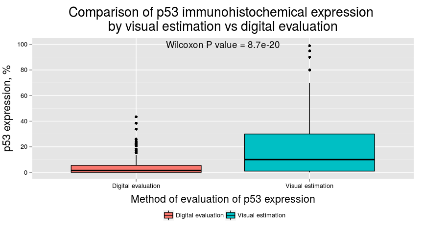
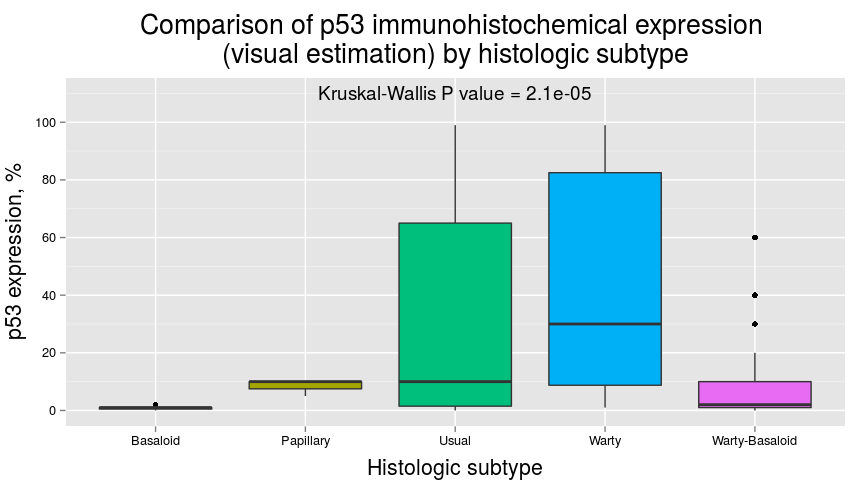
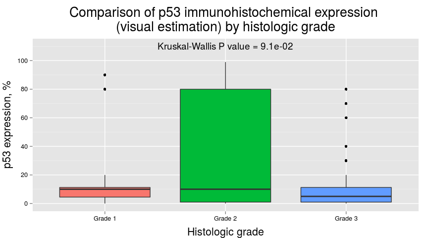

# Evaluation of p53 Immunohistochemical Expression Using Open-Source Software for Digital Image Analysis
Alcides Chaux, M.D.; Arthur L. Burnett, M.D., M.B.A.; George J. Netto, M.D.  

# Summary
The addition of molecular biomarkers is needed to increase the accuracy of pathologic factors as prognosticators of outcome in penile squamous cell carcinomas (SCC). Evaluation of these biomarkers is usually carried out by immunohistochemistry. Herein we assess p53 immunohistochemical expression on tissue samples of penile SCC using freely-available, open-source software packages for digital image analysis. We also compared the results of digital analysis with standard visual estimation. Percentages of p53 positive cells were higher by visual estimation than by digital analysis. However, correlation was high between both methods. Our study shows that evaluation of p53 immunohistochemical expression is feasible using open-source software packages for digital image analysis. Although our analysis was limited to penile SCC, the rationale should also hold for other tumor types in which evaluation of p53 immunohistochemical expression is required. This approach would reduce interobserver variability, and would provide a standardized method for reporting the results of immunohistochemical stains. As these diagnostic tools are freely-available online, researchers and practicing pathologists could incorporate them in their daily practice without increasing diagnostic costs.

# Description
This repository contains the full statistical analysis of the dataset that was used for the article *"Evaluation of p53 Immunohistochemical Expression Using Open-Source Software for Digital Image Analysis: A Tissue Microarray Study of Penile Squamous Cell Carcinomas".* The article is currently under consideration for publication.

This repository also contains the following files:

* The [.pdf version]() of the article
* The [BibTeX]() file containing all the references cited in the article
* The [R script]() that was used for analyzing the dataset and writing the article
* The [R Markdown]() file used for this report
* The [figures]() included in this report in PNG format

Data were analyzed using [R](http://www.r-project.org/) version 3.2.2 "Fire Safety" (R Foundation for Statistical Computing, Vienna, Austria). Results were written using R markdown inside [RStudio](http://www.rstudio.com/) version 0.99.441, powered by the [knitr](http://cran.r-project.org/web/packages/knitr/index.html) package version 1.11.


```r
# Establishing global options
library(knitr)
opts_chunk$set(message = FALSE, warning = FALSE, fig.width = 9)
options(knitr.table.format = "markdown")
# Loading required libraries
library(foreign)
library(dplyr)
```

```
## 
## Attaching package: 'dplyr'
## 
## The following objects are masked from 'package:stats':
## 
##     filter, lag
## 
## The following objects are masked from 'package:base':
## 
##     intersect, setdiff, setequal, union
```

```r
library(stringr)
library(ggplot2)
library(tidyr)
library(simpleR)
```

# Reading the data
First we load the dataset containing the data on p53 expression using visual and digital estimation.


```r
# Reading the data from a STATA file
Data <- read.dta("Article/p53_tma_long.dta")
# Converting the dataset to a tbl format
Data <- tbl_df(Data)
Data
```

```
## Source: local data frame [156 x 6]
## 
##       caseid  spot        subtype grade   p53 ijp53
##        (chr) (int)         (fctr) (int) (int) (dbl)
## 1  S00-03339     4          usual     2    60   3.7
## 2  S00-03339     5          usual     2    10   2.1
## 3  S00-03339     6          usual    NA    NA    NA
## 4  S01-01828     1          usual     3    70  10.3
## 5  S01-01828     2          usual     3    60   8.6
## 6  S01-01828     3          usual     2    70   7.6
## 7  S01-01828     4          usual     3    10   2.6
## 8  S01-01828     5          usual     3    20   8.5
## 9  S01-01828     6          usual     3    20   7.2
## 10 S01-05001     1 warty-basaloid     2     1   0.0
## ..       ...   ...            ...   ...   ...   ...
```

As seen, the dataset consists of a 156 x 6 data frame. Each row corresponds to a TMA spot. The variables recorded includes the following:

* `caseid`: Case ID, corresponding to the SP number assigned to the case.
* `spot`: the TMA spot number corresponding to the caseid.
* `subtype`: the histologic subtype of the tumor.
* `grade`: the histologic grade of the tumor, evaluated at that specific TMA spot.
* `p53`: p53 expression in percentage of positive cells evaluated by visual examination (i.e., naked eye in a computer screen).
* `ijp53`: p53 expression in percentage of positive cells evaluated by digital examination (i.e., using ImageJ).

To improve visualization we revalue/modify the levels of `grade` and `subtype`.


```r
Data$grade <- factor(Data$grade, ordered = TRUE)
Data$grade <- plyr::revalue(Data$grade,
  c(
    "1" = "Grade 1",
    "2" = "Grade 2",
    "3" = "Grade 3")
  )
Data$subtype <- Data$subtype %>% str_to_title()
```

***

# Description by histologic subtype and histologic grade
We will convert the long format of the dataset into a wide format for showing the distribution of histologic subtype and grade per case. For the histologic grade, only the highest grade at any TMA spot was considered.


```r
Data_Wide <- Data %>% group_by(caseid, subtype) %>% summarize(grade = max(grade, na.rm = TRUE))
```

For the plots we will use the `ggplot2` package with a personalized theme.


```r
gtheme <- theme(
  plot.title = element_text(size = 20, vjust = 1.5),
  axis.title.x = element_text(vjust = -.5, size = 16),
  axis.text.x = element_text(color = "black"),
  axis.title.y = element_text(vjust = 1.5, size = 16),
  axis.text.y = element_text(color = "black"),
  legend.position = "bottom"
)
```

The distribution plots are shown below.


```r
ggplot(Data_Wide, aes(x = reorder(subtype, -table(subtype)[subtype]), fill = subtype)) +
  geom_bar(color = "black") +
  geom_text(stat = "bin", aes(label = ..count..), vjust = -1, size = 4) +
  ggtitle("Distribution of histologic subtypes") +
  xlab("Histologic subtype") + ylab("No. cases") +
  expand_limits(y = c(0, 23)) +
  gtheme +
  theme(legend.position = "none")
```

 

```r
with(Data_Wide, descriptive.categorical(reorder(subtype, -table(subtype)[subtype])))
```


|               | No. Cases |  %   |
|:--------------|:---------:|:----:|
|Usual          |    22     | 56.4 |
|Warty-Basaloid |    10     | 25.6 |
|Basaloid       |     3     | 7.7  |
|Warty          |     3     | 7.7  |
|Papillary      |     1     | 2.6  |

***


```r
ggplot(Data_Wide, aes(x = grade, fill = grade)) +
  geom_bar(color = "black") +
  geom_text(stat = "bin", aes(label = ..count..), vjust = -1, size = 4) +
  ggtitle("Distribution of histologic grades") +
  xlab("Histologic grade") + ylab("No. cases") +
  expand_limits(y = c(0, 23)) +
  gtheme +
  theme(legend.position = "none")
```

 

```r
descriptive.categorical(Data_Wide$grade)
```


|        | No. Cases | %  |
|:-------|:---------:|:--:|
|Grade 1 |     5     | 13 |
|Grade 2 |    14     | 36 |
|Grade 3 |    20     | 51 |

***

# Distribution of p53 immunohistochemical expression
Evaluation of p53 expression was carried out spot by spot. Each TMA spot was scanned using the APERIO system (Aperio Technologies, Inc., Vista, CA) and uploaded to TMAJ, an open-source platform for online evaluation of TMA images, available at <http://tmaj.pathology.jhmi.edu>. Images were scanned at a $20x$ resolution, yielding an image scale of $2.65 \mu/mm$. Images were downloaded from the TMAJ database to a local computer.

Immunohistochemical expression of p53 was evaluated using 2 methods: visual estimation and digital evaluation. Each method is described in a separate subsetion.

## Visual estimation of p53 expression
For visual analysis, percentages of p53 positive nuclei were estimated by naked eye on a computer screen, without the use of any specialized software. The distribution of p53 expression by visual estimation is shown below.


```r
ggplot(Data, aes(x = p53, fill = factor(0))) +
  geom_histogram(color = "black", binwidth = 10) +
  ggtitle("Distribution of p53 immunohistochemical expression \nby visual estimation") +
  xlab("Percentage of p53 positive tumor cells") + ylab("No. TMA spots") +  
  gtheme +
  theme(legend.position = "none")
```

 

```r
descriptive.numerical(Data$p53)
```


|Statistics          | Values |
|:-------------------|:------:|
|Mean                |  23.4  |
|Standard Deviation  |  32.4  |
|Median              |   10   |
|Interquartile Range |   29   |
|Mininum             |   0    |
|Maximum             |   99   |

***

## Digital evaluation of p53 expression
For digital analysis, the open-source software ImageJ version 1.44, available at <http://rsb.info.nih.gov/ij>, was used along with the immunoratio plug-in, available at <http://imtmicroscope.uta.fi/immunoratio>.

The immunoratio plug-in calculates the percentage of positively stained nuclear area (labeling index) by using a color deconvolution algorithm previously described by [Tuominen *et al*](http://www.ncbi.nlm.nih.gov/pubmed/20663194). This deconvolution algorithm separates the staining components (diaminobenzidine and hematoxylin) based on user-defined thresholds for positive nuclei (brown pixels) and negative nuclei (blue pixels). These thresholds were adjusted in a training set of 5 randomly selected TMA spots, until at least 95% of nuclei were identified, either as positive or negative. The same algorithm was then used to estimate in batch the percentage of positive cells. Results were exported afterward to a database containing the pathologic features of the case.


```r
ggplot(Data, aes(x = ijp53, fill = factor(0))) +
  geom_histogram(color = "black", binwidth = 5) +
  ggtitle("Distribution of p53 immunohistochemical expression \nby digital evaluation") +
  xlab("Percentage of p53 positive tumor cells") + ylab("No. TMA spots") +  
  gtheme +
  theme(legend.position = "none")
```

 

```r
descriptive.numerical(Data$ijp53)
```


|Statistics          | Values |
|:-------------------|:------:|
|Mean                |  4.7   |
|Standard Deviation  |  7.6   |
|Median              |  1.5   |
|Interquartile Range |  5.5   |
|Mininum             |   0    |
|Maximum             |  43.4  |

***

## Comparing visual estimation vs digital evaluation of p53 expression
Below are the density plots and boxplots of p53 immunohistochemical expression using visual estimation and digital evaluation. We also include a scatterplot showing the correlation between both methods.

To aid in the visual display of data, we decided to transform the percentages of p53 expression into logarithms using *X~log~ = log(X + 1)* where *X* is the percentage of p53 expression and *log* is the base 10 logarithm of *X*.


```r
# Reshaping the data into long format
Data_Long <- Data %>%
  select(p53, ijp53) %>%
  gather(method, value, p53:ijp53) %>%
  mutate(
    method = ifelse(method == "p53", "Visual estimation", "Digital evaluation"),
    value = log10(value + 1)
    )
# Density plots for p53 expression
ggplot(data = Data_Long, aes(x = value, fill = method)) +
  geom_density(alpha = .5) +
  ggtitle("Comparison of p53 immunohistochemical expression \nby visual estimation vs digital evaluation") +
  xlab("p53 expression, log %") + ylab("Density") +  
  gtheme +
  theme(legend.title = element_blank())
```

 

```r
# Boxplots for p53 expression
p53_box <- with(data = Data_Long, wilcox.test(
  x = value[method == "Digital evaluation"],
  y = value[method == "Visual estimation"],
  paired = TRUE
  )$p.value
)
p53_box <- format(p53_box, digits = 2, scientific = TRUE)
ggplot(data = Data_Long, aes(x = method, y = value)) +
  geom_boxplot(aes(fill = method), color= "black") +
  annotate("text",
    label = paste("Wilcoxon P value =", p53_box),
    x = 1.5, y = 2) +
  ggtitle("Comparison of p53 immunohistochemical expression \nby visual estimation vs digital evaluation") +
  xlab("Method of evaluation of p53 expression") +
  ylab("p53 expression, log %") +  
  gtheme
```

 

```r
descriptive.numerical.group(Data_Long$value, Data_Long$method)
```


|                    | Digital evaluation | Visual estimation |
|:-------------------|:------------------:|:-----------------:|
|Mean                |        0.5         |        0.9        |
|Standard Deviation  |        0.5         |        0.7        |
|Median              |        0.4         |        1.0        |
|Interquartile Range |        0.8         |        1.2        |
|Minimum             |        0.0         |        0.0        |
|Maximum             |        1.6         |        2.0        |

```r
# Correlation between methods of evaluating p53 expression
p53_cor <- with(data = Data_Long, cor.test(
  x = value[method == "Digital evaluation"],
  y = value[method == "Visual estimation"],
  method = "spearman", exact = TRUE
  )
)
p53_cor_p <- format(p53_cor$p.value, digits = 2, scientific = TRUE)
p53_cor_rho <- format(p53_cor$estimate, digits = 2)
ggplot(data = Data_Long, aes(x = value[method == "Digital evaluation"], y = value[method == "Visual estimation"])) +
  geom_point(shape = 1) +
  geom_smooth(method = lm) +
  annotate("text",
    label = paste("P value =", p53_cor_p, "\nSpearman's rho =", p53_cor_rho),
    x = 0, y = 2.25, hjust = 0) +
  ggtitle("Correlation of p53 immunohistochemical expression \nby visual estimation vs digital evaluation") +
  xlab("Digital evaluation, log %") +
  ylab("Visual estimation, log %") +  
  gtheme
```

 

# Comparison of p53 expression with pathologic features
Below is the comparison of p53 expression by visual estimation and digital evaluation considering histologic subtype and histologic grade. For this purpose we decided to use the mean values of p53 expression.

To aid in the visual display of data, we decided to transform the percentages of p53 expression into logarithms using *X~log~ = log(X + 1)* where *X* is the percentage of p53 expression and *log* is the base 10 logarithm of *X*.


```r
# Calculating p53 mean expression by visual estimation and digital evaluation
Data_AVG <- Data %>%
  group_by(caseid, subtype) %>%
  summarize(
    grade = max(grade, na.rm = TRUE),
    p53 = log10(mean(p53, na.rm = TRUE) + 1),
    ijp53 = log10(mean(ijp53, na.rm = TRUE) + 1)
    )
```

## Comparison by histologic subtype


```r
# Comparing p53 mean expression (visual estimation) by histologic subtype
p53_subtype <- kruskal.test(subtype ~ p53, data = Data_AVG)$p.value
p53_subtype <- format(p53_subtype, digits = 2, scientific = TRUE)
ggplot(data = Data_AVG, aes(x = subtype, y = p53, fill = subtype)) +
  geom_boxplot() +
  expand_limits(y = c(0, 2.1)) +
  annotate("text", label = paste("Kruskal-Wallis P value =", p53_subtype),
    y = 2.1, x = 3, hjust = 0.5) +
  ggtitle("Comparison of p53 immunohistochemical expression \n(visual estimation) by histologic subtype") +
  xlab("Histologic subtype") +
  ylab("p53 expression, log %") +  
  gtheme + theme(legend.position = "none")
```

 

```r
with(Data_AVG, descriptive.numerical.group(p53, subtype))
```


|                    | Basaloid | Papillary | Usual | Warty | Warty-Basaloid |
|:-------------------|:--------:|:---------:|:-----:|:-----:|:--------------:|
|Mean                |   0.2    |     1     |  1.1  |  1.6  |      0.8       |
|Standard Deviation  |   0.2    |    NA     |  0.7  |  0.5  |      0.4       |
|Median              |   0.3    |     1     |  1.1  |  1.8  |      0.8       |
|Interquartile Range |   0.2    |     0     |  1.2  |  0.5  |      0.4       |
|Minimum             |   0.0    |     1     |  0.0  |  1.0  |      0.1       |
|Maximum             |   0.3    |     1     |  2.0  |  2.0  |      1.7       |

```r
# Comparing p53 mean expression (digital evaluation) by histologic subtype
ijp53_subtype <- kruskal.test(subtype ~ ijp53, data = Data_AVG)$p.value
ijp53_subtype <- format(ijp53_subtype, digits = 2, scientific = TRUE)
ggplot(data = Data_AVG, aes(x = subtype, y = ijp53, fill = subtype)) +
  geom_boxplot() +
  expand_limits(y = c(0, 1.6)) +
  annotate("text", label = paste("Kruskal-Wallis P value =", ijp53_subtype),
    y = 1.6, x = 3, hjust = 0.5) +
  ggtitle("Comparison of p53 immunohistochemical expression \n(digital evaluation) by histologic subtype") +
  xlab("Histologic subtype") +
  ylab("p53 expression, log %") +  
  gtheme +
  theme(legend.position = "none")
```

 

```r
with(Data_AVG, descriptive.numerical.group(ijp53, subtype))
```


|                    | Basaloid | Papillary | Usual | Warty | Warty-Basaloid |
|:-------------------|:--------:|:---------:|:-----:|:-----:|:--------------:|
|Mean                |   0.1    |    0.2    |  0.6  |  0.9  |      0.4       |
|Standard Deviation  |   0.1    |    NA     |  0.4  |  0.5  |      0.3       |
|Median              |   0.1    |    0.2    |  0.7  |  1.0  |      0.4       |
|Interquartile Range |   0.1    |    0.0    |  0.5  |  0.5  |      0.4       |
|Minimum             |   0.0    |    0.2    |  0.0  |  0.3  |      0.0       |
|Maximum             |   0.3    |    0.2    |  1.4  |  1.4  |      1.0       |

***

## Comparison by histologic grade


```r
# Comparing p53 mean expression (visual estimation) by histologic grade
p53_grade <- kruskal.test(grade ~ p53, data = Data_AVG)$p.value
p53_grade <- format(p53_grade, digits = 2, scientific = TRUE)
ggplot(data = Data_AVG, aes(x = grade, y = p53, fill = grade)) +
  geom_boxplot() +
  expand_limits(y = c(0, 2.1)) +
  annotate("text", label = paste("Kruskal-Wallis P value =", p53_grade),
    y = 2.1, x = 2, hjust = 0.5) +
  ggtitle("Comparison of p53 immunohistochemical expression \n(visual estimation) by histologic grade") +
  xlab("Histologic grade") +
  ylab("p53 expression, log %") +  
  gtheme +
  theme(legend.position = "none")
```

 

```r
with(Data_AVG, descriptive.numerical.group(p53, grade))
```


|                    | Grade 1 | Grade 2 | Grade 3 |
|:-------------------|:-------:|:-------:|:-------:|
|Mean                |   0.9   |   1.1   |   0.9   |
|Standard Deviation  |   0.4   |   0.8   |   0.6   |
|Median              |   1.0   |   1.3   |   0.9   |
|Interquartile Range |   0.2   |   1.6   |   0.8   |
|Minimum             |   0.1   |   0.0   |   0.0   |
|Maximum             |   1.2   |   2.0   |   1.8   |

```r
# Comparing p53 mean expression (digital evaluation) by histologic grade
ijp53_grade <- kruskal.test(grade ~ ijp53, data = Data_AVG)$p.value
ijp53_grade <- format(ijp53_grade, digits = 2, scientific = TRUE)
ggplot(data = Data_AVG, aes(x = grade, y = ijp53, fill = grade)) +
  geom_boxplot() +
  expand_limits(y = c(0, 1.6)) +
  annotate("text", label = paste("Kruskal-Wallis P value =", ijp53_grade),
    y = 1.6, x = 2, hjust = 0.5) +
  ggtitle("Comparison of p53 immunohistochemical expression \n(digital evaluation) by histologic grade") +
  xlab("Histologic grade") +
  ylab("p53 expression, log %") +  
  gtheme +
  theme(legend.position = "none")
```

 

```r
with(Data_AVG, descriptive.numerical.group(ijp53, grade))
```


|                    | Grade 1 | Grade 2 | Grade 3 |
|:-------------------|:-------:|:-------:|:-------:|
|Mean                |   0.4   |   0.7   |   0.5   |
|Standard Deviation  |   0.3   |   0.5   |   0.4   |
|Median              |   0.4   |   0.6   |   0.5   |
|Interquartile Range |   0.2   |   0.9   |   0.6   |
|Minimum             |   0.0   |   0.0   |   0.0   |
|Maximum             |   0.7   |   1.4   |   1.2   |

***

# Conclusions
Evaluation of p53 immunohistochemical expression is feasible using open-source software packages for digital image analysis. Although our analysis was limited to penile SCC, the rationale should also hold for other tumor types in which evaluation of p53 expression is required. This approach would reduce interobserver variability, and would provide a standardized method for reporting the results of immunohistochemical stains. As these diagnostic tools are freely available over the Internet, researchers and practicing pathologists could incorporate them in their daily practice without increasing diagnostic costs.
